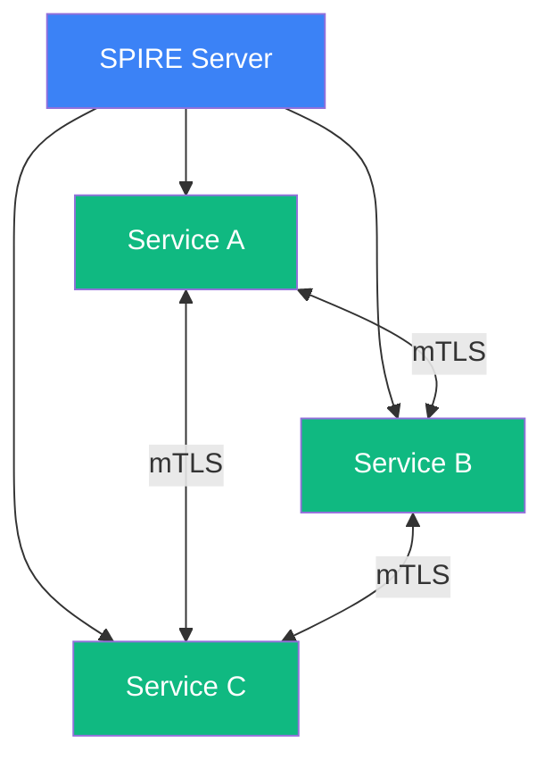
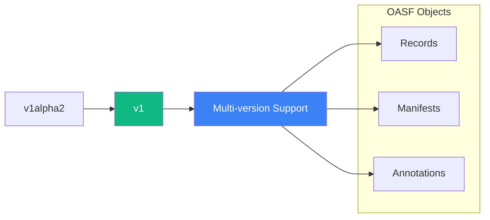
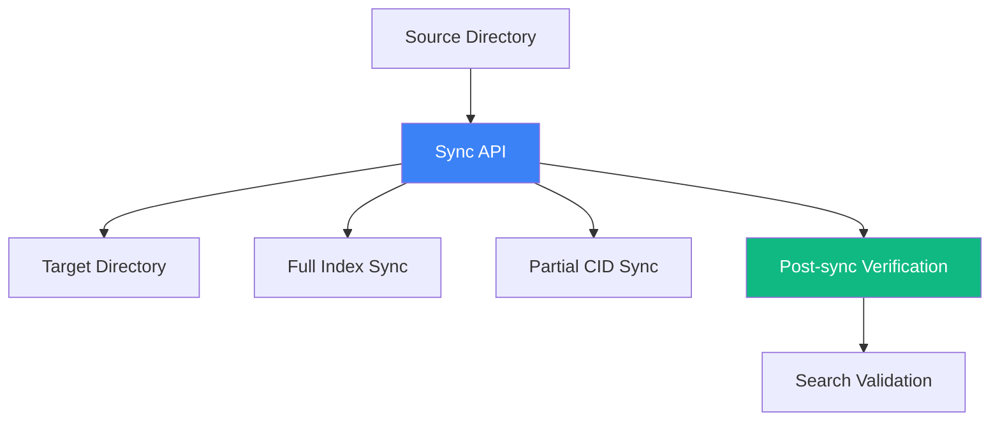
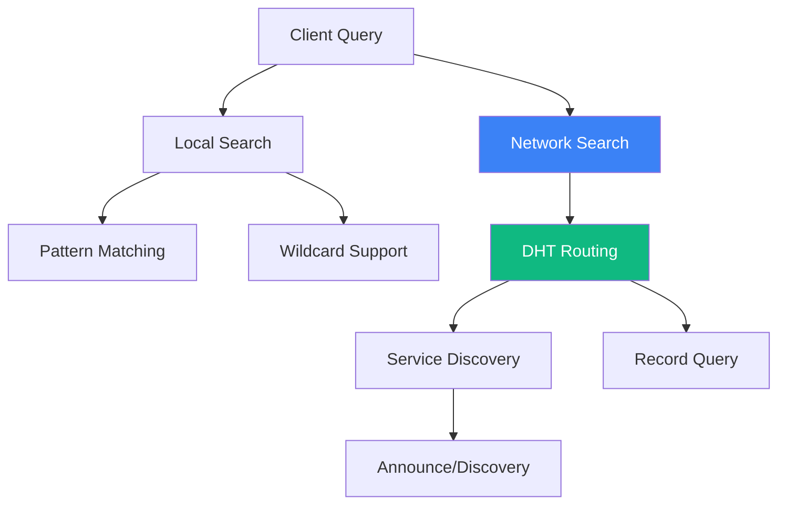

<div class="pt-6">
  
</div>

<br>

# DIR v0.3.0 Release
## Zero-Trust Architecture & Enhanced Developer Experience

<div class="pt-8">
  <span class="px-2 py-1 rounded cursor-pointer" hover="bg-white bg-opacity-10">
    Major Release - September 19, 2025
  </span>
</div>

<div class="abs-br m-6 flex gap-2">
  <a href="https://github.com/agntcy/dir" target="_blank" alt="GitHub"
    class="text-xl slidev-icon-btn opacity-50 !border-none !hover:text-white">
    <carbon-logo-github />
  </a>
</div>

---
layout: statement
---

# Key Highlights

<br>

### **Zero-Trust Security Architecture**
X.509-based SPIFFE/SPIRE identity framework with federation support

<br>

### **Content Standardization**
Unified Core v1 API with deterministic CID generation

<br>

### **Search & Discovery**
Network-wide record discovery with DHT-based routing

<br>

### **Enhanced Developer Experience**
Native SDKs for Go, JS, TS, and Python with unified tooling

---
background: "#fef3c7"
layout: center
---

# Zero-Trust Security Architecture

---
layout: two-cols-header
---

# Security Framework

Building a foundation of trust with industry-standard protocols

::left::

## SPIFFE/SPIRE Identity



::right::

## Key Features

- **X.509-based Identity**: Cryptographic service identity
- **Federation Support**: Cross-cluster trust relationships
- **Policy-based Authorization**: Fine-grained access controls
- **mTLS Communication**: Secure service-to-service communication
- **OCI-native PKI**: Client and server-side verification

<br>

**Impact**: Zero-trust security model ensures data integrity and service authenticity across distributed deployments

---
layout: two-cols-header
---

# Authorization & Verification

Comprehensive security controls for enterprise deployments

::left::

## Policy-Based Access Control

```yaml
# Example authorization policy
apiVersion: v1
kind: AuthorizationPolicy
metadata:
  name: record-access
spec:
  rules:
  - subjects:
    - user: "service-a"
    actions:
    - read
    - write
    resources:
    - records/*
  - subjects:
    - user: "service-b"
    actions:
    - read
    resources:
    - records/public/*
```

::right::

## Verification Features

- **Server-side Verification**: Integrated with zot registry
- **Client-side Fallback**: Graceful degradation
- **OCI-native Signatures**: Standard compliance
- **Policy Engine**: Flexible authorization rules

<br>

**Impact**: Enterprise-ready security controls enable safe deployment in production environments with compliance requirements

---
background: "#ecfdf5"
layout: center
---

# Content Standardization

---
layout: two-cols-header
---

# Unified Core v1 API

Standardized interfaces across all components

::left::

## API Evolution



::right::

## Standardization Benefits

- **Deterministic CID Generation**: Canonical JSON marshaling
- **Cross-language Consistency**: Same CIDs across Go, Python, JS
- **OCI-native Storage**: Standard container registry support
- **Rich Manifest Annotations**: Enhanced metadata support
- **Multi-version API**: Backward compatibility

<br>

**Impact**: Ensures data consistency and interoperability across different language implementations and storage backends

---
layout: two-cols-header
---

# Storage & Synchronization

Enhanced data management capabilities

::left::

## Synchronization Features



::right::

## Storage Improvements

- **Full & Partial Sync**: Flexible data replication
- **CID-based Selection**: Efficient selective sync
- **Post-sync Verification**: Data integrity checks
- **Automated Workflows**: Simple migration processes
- **Search Integration**: Immediate searchability

<br>

**Impact**: Enables reliable data replication and migration scenarios for distributed deployments and disaster recovery

---
background: "#fef2f2"
layout: center
---

# Search & Discovery

---
layout: two-cols-header
---

# Network-wide Discovery

Distributed search capabilities with DHT-based routing

::left::

## Search Architecture



::right::

## Discovery Features

- **Local Search**: Wildcard and pattern matching
- **Network Discovery**: DHT-based distributed search
- **Label-based Announce**: Service advertisement
- **RecordQuery Interface**: Standardized search API
- **Prefix-based Search**: Efficient key-space navigation

<br>

**Impact**: Enables decentralized service discovery and content location across distributed network deployments

---
layout: two-cols-header
---

# Search Capabilities

Enhanced query and pattern matching

::left::

## Search Examples

```bash
# Wildcard search
dirctl search "agent-*"

# Pattern matching
dirctl search --pattern "*.oasf"

# Network-wide discovery
dirctl discover --network --prefix "com.example"

# Label-based search
dirctl search --labels "type=agent,env=prod"
```

::right::

## Search Features

- **Wildcard Support**: Flexible pattern matching
- **Network Queries**: Cross-node search capabilities
- **Label Filtering**: Metadata-based discovery
- **Prefix Search**: Hierarchical navigation
- **Real-time Results**: Live search updates

<br>

**Impact**: Dramatically improves content discoverability and service location in large-scale deployments

---
background: "#f0f9ff"
layout: center
---

# Enhanced Developer Experience

---
layout: two-cols-header
---

# Multi-Language SDK Support

Unified developer experience across languages

::left::

## SDK Matrix

| Language   | Version | Features |
|------------|---------|----------|
| **Go**     | v0.3.0  | ✅ Full API |
| **Python** | v0.3.0  | ✅ Full API |
| **JavaScript** | v0.3.0 | ✅ Full API |
| **TypeScript** | v0.3.0 | ✅ Full API |

## Common Features
- gRPC client code
- Sync support
- Sign & verification
- Streaming support
- Consistent interfaces

::right::

## SDK Examples

```python
# Python SDK
from dir_client import DirectoryClient

client = DirectoryClient("localhost:8080")
records = await client.search("agent-*")
```

```javascript
// JavaScript SDK
import { DirectoryClient } from '@agntcy/dir-js';

const client = new DirectoryClient('localhost:8080');
const records = await client.search('agent-*');
```

<br>

**Impact**: Reduces development time and learning curve across different programming languages and environments

---
layout: two-cols-header
---

# Tooling & CLI Improvements

Streamlined command-line and deployment experience

::left::

## CLI Enhancements

```bash
# Simplified workflows
dirctl push --stdin < record.json
dirctl sync --source remote://hub.agntcy.org
dirctl search --network "agent-*"

# Better error handling
dirctl push invalid.json
# Error: validation failed on line 15
# Expected: string, got: number

# Stream support
dirctl watch --pattern "*.oasf" | jq .
```

::right::

## Deployment Features

- **Kubernetes Support**: Helm charts with SPIRE
- **Federation Ready**: Cross-cluster deployments  
- **Standardized Config**: Consistent across components
- **Error Suppression**: Clean runtime experience
- **Stream Processing**: Real-time data handling

<br>

**Impact**: Significantly improves operational efficiency and reduces time-to-deployment for development teams

---
layout: statement
---

# Ecosystem Impact

<br>

### **Enterprise Ready**
Zero-trust security enables production deployments in regulated environments

<br>

### **Developer Productivity**
Multi-language SDKs and unified tooling reduce integration complexity

<br>

### **Scalability**
DHT-based discovery and sync capabilities support large-scale deployments

<br>

### **Interoperability**
Standardized APIs ensure compatibility across different implementations

---
background: "#fefce8"
layout: center
---

# Looking Forward

---
layout: two-cols-header
---

# Upcoming Features

Planned enhancements for future releases

::left::

## Security Enhancements
- **Advanced Policy Engine**: Dynamic authorization rules
- **Audit Logging**: Comprehensive security events
- **Key Rotation**: Automated certificate management
- **Multi-tenant Support**: Isolated environments

## Performance Optimizations
- **Caching Layer**: Improved query performance
- **Compression**: Reduced storage footprint
- **Batch Operations**: Bulk record management
- **Connection Pooling**: Optimized client connections

::right::

## Integration Expansions
- **Cloud Provider SDKs**: AWS, Azure, GCP integrations
- **Monitoring Integration**: Prometheus, Grafana support
- **Service Mesh**: Istio, Linkerd compatibility
- **CI/CD Pipelines**: GitHub Actions, GitLab CI

## Developer Experience
- **Visual Tools**: Web-based management interface
- **Documentation**: Interactive API explorer
- **Testing Framework**: Integration test utilities
- **Migration Tools**: Automated upgrade assistance

---
layout: two-cols-header
---

# Migration & Compatibility

Transition guidance for existing deployments

::left::

## Breaking Changes

⚠️ **API Changes**: v0.3.0 introduces breaking changes
- API layer restructured
- CLI usage patterns updated
- SDK interfaces modified
- Storage format changes

## Migration Path

```bash
# Export data from v0.2.x
repo=localhost:5000/dir
for tag in $(oras repo tags $repo); do
    digest=$(oras resolve $repo:$tag)
    oras blob fetch --output - $repo@$digest | \
    dirctl push --stdin
done
```

::right::

## Compatibility Matrix

| Component | v0.2.x | v0.3.0 | Status |
|-----------|--------|--------|--------|
| dir-apiserver | ✅ | ✅ | ⚠️ Migration Required |
| dirctl | ✅ | ✅ | ⚠️ Breaking Changes |
| SDKs | ✅ | ✅ | ⚠️ Interface Changes |
| Helm Charts | ✅ | ✅ | ⚠️ Config Updates |

## Support Timeline
- **v0.2.x**: Security fixes until March 2026
- **v0.3.x**: Active development and support
- **Migration Tools**: Available in v0.3.1

---
layout: end
---

# Thank You

## DIR v0.3.0: Ready for Production

<div class="text-xl mt-8">
  <carbon-logo-github class="inline-block" /> 
  <a href="https://github.com/agntcy/dir" target="_blank" class="border-none">
    github.com/agntcy/dir
  </a>
</div>

<div class="text-lg mt-4">
  🚀 **Download**: Latest release available now<br>
  📖 **Documentation**: Updated guides and examples<br>
  💬 **Community**: Join our discussions and contribute
</div>

<div class="mt-8 text-sm opacity-75">
  Questions? Issues? Contributions welcome!
</div>
